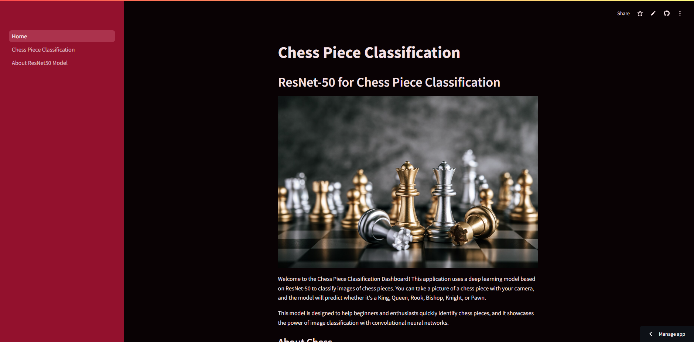

<!-- TABLE OF CONTENTS -->
<details>
  <summary>Table of Contents</summary>
  <ol>
    <li>
      <a href="#about-the-project">About The Project</a>
      <ul>
        <li><a href="#built-with">Built With</a></li>
      </ul>
    </li>
    <li>
      <a href="#getting-started">Getting Started</a>
      <ul>
        <li><a href="#installation">Prerequisites</a></li>
        <li><a href="#website">Installation</a></li>
      </ul>
    </li>
    <li><a href="#usage">Usage</a></li>
  </ol>
</details>

<!-- ABOUT THE PROJECT -->
## About The Project



This repository contains the [Chess Piece Classification](https://chessclass.streamlit.app) project that uses a ResNet50 model to classify images of chess pieces, including Bishop, King, Knight, Pawn, Queen, and Rook. The model is trained on a labeled dataset of chess piece images, and the classification results are displayed in an interactive [Streamlit app](https://chessclass.streamlit.app) that allows users to upload or capture images for real-time predictions.

<b>Key Objectives:</b>
* <b>Automated Chess Piece Detection:</b> Automatically classify chess piece images into six categories (Bishop, King, Knight, Pawn, Queen, Rook) using a classification model.

<b>Features:</b>
* <b>Real-Time Classification:</b> Upload or capture images through a camera interface in Streamlit to classify chess pieces in real time.
* <b>Confusion Matrix Visualization:</b> Display the model’s performance with a confusion matrix to analyze accuracy per class.

<p align="right">(<a href="#about-the-project">back to top</a>)</p>

### Built With

[![Python][Python]][Python-url]

<p align="right">(<a href="#about-the-project">back to top</a>)</p>

<!-- GETTING STARTED -->
## Getting Started

### Installation

1. Clone the repository
   ```bash
   git clone https://github.com/traviszusa/chess-classifier-resnet50
   ```
2. Make an environment
   ```bash
   python -m venv .venv
   ```
3. Activate the environment
   ```bash
   .venv/Scripts/activate
   ```
4. Install requirements for running the program
   ```bash
   pip install -r requirements.txt
   ```

### Website

1. Activate the environment before
   ```bash
   .venv/Scripts/activate
   ```
2. Run app.py with streamlit library
   ```bash
   streamlit run Home.py
   ```

<p align="right">(<a href="#about-the-project">back to top</a>)</p>

<!-- USAGE EXAMPLES -->
## Usage

Open the website with a virtual environment or click this link on <a href="https://chessclass.streamlit.app">ChessClass</a> and explore the features.

<p align="right">(<a href="#about-the-project">back to top</a>)</p>

[Python]: https://img.shields.io/badge/python-3670A0?style=for-the-badge&logo=python&logoColor=ffdd54
[Python-url]: https://www.python.org 